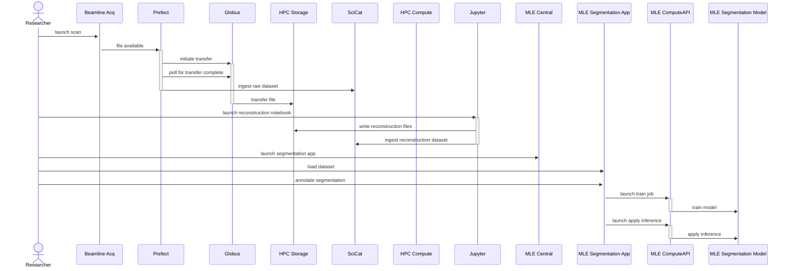

# Design

## High Level Sequence

```mermaid

sequenceDiagram
    actor Researcher
    participant Beamline Acq
    participant Prefect
    participant Globus
    participant HPC Storage
    participant SciCat
    participant HPC Compute 
    participant Jupyter
    participant MLE Central
    participant MLE Segmentation App
    participant MLE ComputeAPI
    participant MLE Segmentation Model

    Researcher ->>+ Beamline Acq: launch scan
    Beamline Acq ->>+ Prefect: file available
    Prefect ->>+ Globus: initiate transfer
    Prefect ->> Globus: poll for transfer complete
    Prefect ->>- SciCat: ingest raw dataset
    Globus ->>- HPC Storage: transfer file
    
    Researcher ->>+ Jupyter: launch reconstruction notebook
    Jupyter ->> HPC Storage: write reconstruction files
    Jupyter ->>- SciCat: ingest reconstruction dataset
    
    Researcher ->> MLE Central: launch segmentation app
    Researcher ->> MLE Segmentation App: load dataset
    Researcher ->>+ MLE Segmentation App: annotate segmentation
    MLE Segmentation App ->>+ MLE ComputeAPI: launch train job
    MLE ComputeAPI ->>- MLE Segmentation Model: train model
    MLE Segmentation App ->>+ MLE ComputeAPI: launch apply inference
    MLE ComputeAPI ->>- MLE Segmentation Model: apply inference
    


```